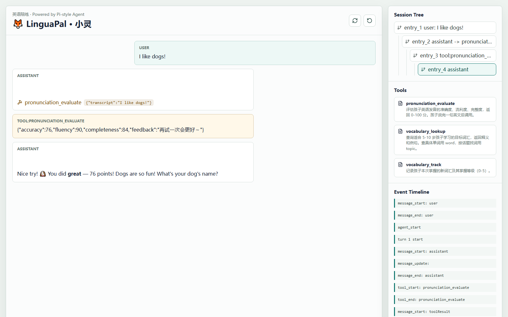

# 🦊 LinguaPal · 少儿英语陪练 Agent

LinguaPal（小灵）是一个面向 **5-10 岁中国孩子** 的 AI 英语陪练 Agent。孩子用简单英语和它聊天，它用简单英语回应，并在对话过程中调用工具完成**发音评分**、**词汇解释**和**掌握度记录**。

它不是一个"套壳聊天机器人"：仓库里包含一个受 [Pi Agent](https://github.com/earendil-works/pi) 架构启发、从零实现的 **Agent Loop 运行时**——工具调用、行为护栏、会话分支、离线降级，都是真实可运行的能力。

> 一句话定位：**一个不会不耐烦、不会评判、随时在线的英语玩伴。**

---

## ✨ 核心能力

### 三大陪练工具

| 工具 | 作用 | 触发场景 | 返回 |
| --- | --- | --- | --- |
| `pronunciation_evaluate` | 评估发音 | 孩子说完一句英语 | `accuracy` / `fluency` / `completeness`（0-100）+ `feedback` |
| `vocabulary_lookup` | 查目标词汇 | 孩子问 `What does adopt mean?` | 单词释义 + 例句；查不到时回传 `availableTopics` 提示模型 |
| `vocabulary_track` | 记录掌握状态 | 孩子说 `I learned adopt today.` | 掌握等级 0-5 + 累计记录数 |

`vocabulary_lookup` 支持两种检索方式：用 `word` 精确查某个词（跨话题检索），或用 `topic` 按话题取词。内置 7 个话题（animals / food / colors / numbers / family / school / hobbies，共 16 个词），并兼容 `animal`、`动物`、`colour`、`颜色` 等别名写法。

### 运行时能力

| 能力 | 说明 |
| --- | --- |
| **Agent Loop** | 模型请求 → 工具执行 → 结果回写 → 再请求模型，最多 6 轮，防止无效循环 |
| **行为护栏** | `beforeToolCall` 钩子拦截非法调用：发音内容为空时 **block**，掌握等级非法时 **rewrite** 成 0-5 |
| **会话树** | JSONL 落盘，支持按 `leafId` 切换分支，历史上下文可回退 |
| **上下文压缩** | 长会话自动折叠为"摘要 + 最近消息" |
| **离线降级** | 没有 API Key 时自动切换到 MockModel（小灵离线版），孩子仍能看到评分反馈 |

### 人设约束

System Prompt 里写死了产品级约束，而不是靠模型自觉：

- 始终用简单英语回复，**每次最多 3 句话，单句不超过 8 个词**
- **每次回复最多引入 1 个新目标词汇**，并用 **加粗** 显示
- 孩子说错时先肯定再示范；孩子说中文时温和地引导他用英语再试
- 话题限定在动物、食物、颜色、数字、家庭、学校、爱好，避开政治、暴力、成人内容

---

## ⚠️ 当前实现的边界

为避免误解，把还没做的事也写清楚：

| 项 | 现状 |
| --- | --- |
| **输入方式** | 目前是**文字输入**，还没接入麦克风录音。语音采集在路线图中 |
| **发音评分** | 目前是**启发式占位实现**（基于句子长度与结尾标点计算），不是真实声学评测。`execute` 签名已固定，后续可替换为讯飞/腾讯语音评测 API |
| **掌握度存储** | `vocabulary_track` 的记录存在**进程内存**，重启即清空，尚未落盘 |
| **内容安全** | 目前依赖 System Prompt 的话题约束 + 工具层参数校验，**没有独立的内容审核层** |
| **评分条 UI** | 分数以工具结果卡片（JSON）和右侧 Event Timeline 呈现，**没有专门的评分条组件** |

---

## 🚀 快速开始

### 前置要求

- Node.js 18+（本仓库验证版本 v22）
- 可选：任意 OpenAI 兼容的 API Key（推荐商汤 SenseNova，有免费额度）

### 安装

```bash
git clone https://github.com/esanwu-bot/LinguaPal.git
cd LinguaPal
npm install
```

### 配置（二选一）

**方式 A：不配任何 Key，直接体验离线版小灵**（无网络也能跑）

跳过本节，直接启动即可。

**方式 B：接入真实模型**

在**仓库根目录**创建 `.env.local`（已在 `.gitignore` 中）：

```bash
CW_AGENT_LLM_PROVIDER=sensenova
CW_AGENT_LLM_BASE_URL=https://your-endpoint/v1
CW_AGENT_LLM_KEY=你的key
CW_AGENT_LLM_MODEL=你的模型名
```

> ⚠️ `.env.local` 不要提交到仓库。`CW_AGENT_LLM_KEY=` 优先于 `OPENAI_API_KEY=`，两套变量名都支持，见下方「环境变量参考」。

### 启动

**Windows（推荐）**——双击 `start_teaching_agent.bat`，或：

```powershell
powershell -ExecutionPolicy Bypass -File .\start_teaching_agent.ps1
```

启动脚本会先加载 `.env.local`，并在控制台打印当前使用的模型：

```text
[env] loaded .../.env.local
[env] model    = 你的模型名
[env] apiKey   = ****** (loaded, hidden)
```

**macOS / Linux / 手动启动**——先把变量导出到当前 shell，再运行：

```bash
export CW_AGENT_LLM_KEY=你的key
export CW_AGENT_LLM_BASE_URL=https://your-endpoint/v1
export CW_AGENT_LLM_MODEL=你的模型名
npm run teaching-agent:dev
```

默认地址：

| 服务 | 地址 |
| --- | --- |
| 前端 | http://localhost:5174/ |
| API | http://localhost:4317/ |

> 🔴 **重要**：直接执行 `npm run teaching-agent:dev` **不会读取 `.env.local`**（tsx 不自动加载 env 文件），此时服务会以 MockModel 模式启动。想用真实模型，请务必走启动脚本，或先手动导出环境变量。
> 两个服务也会在 `start_pi.bat` 的菜单里提供（可选启动 Agent / 教程站点 / 全部）。

### 验证是否跑通

在输入框发送 `I like dogs!`，**离线模式**下应稳定得到这条链路（MockModel 是确定性的，结果可复现）：

```text
user        :: I like dogs.
assistant   :: That's great! 🦊 Can you say it again?  → pronunciation_evaluate {"transcript":"I like dogs."}
toolResult  :: {"accuracy":76,"fluency":90,"completeness":84,"feedback":"再试一次会更好～"}
assistant   :: Nice job! Your score is 76. Let's keep going!
```

要点：

1. 消息顺序必须是 `user → assistant(含 toolCall) → toolResult → assistant`，说明"工具调用要跑两轮"的闭环成立。
2. 右侧 **Event Timeline** 应出现 `tool_execution_start pronunciation_evaluate` 与 `tool_execution_end`。
3. 右侧 **Tools** 面板应恰好只有 3 个工具，**不应**出现 `list_files` / `read_file` / `write_note`。

真实模型模式下，额外验证 `What does adopt mean?` 触发 `vocabulary_lookup`、`I learned adopt today.` 触发 `vocabulary_track`。

---

## 🖼️ 演示

下面是离线模式（MockModel）下的真实运行截图。孩子说 `I like dogs!`，小灵触发 `pronunciation_evaluate`，返回 `accuracy: 76 / fluency: 90 / completeness: 84`，并用简单英语继续对话：



左侧是实时对话流，右侧依次是 **Session Tree**、**Tools**（3 个陪练工具）和 **Event Timeline**（工具调用闭环）。

---

## 📁 项目结构

```text
LinguaPal/
├── examples/
│   ├── demos/                       # Pi Agent 原理教学 Demo（01-05），与产品无关
│   └── teaching-agent/              # 👈 LinguaPal 产品主入口
│       ├── src/
│       │   ├── server/
│       │   │   ├── agent/
│       │   │   │   ├── prompts.ts        # 小灵的人设与行为规则
│       │   │   │   ├── tutorTools.ts     # 三大陪练工具 + 独立注册表
│       │   │   │   ├── loop.ts           # Agent Loop（含 block / rewrite 钩子）
│       │   │   │   ├── mockModel.ts      # 离线降级版小灵
│       │   │   │   ├── realModel.ts      # OpenAI 兼容适配器
│       │   │   │   ├── sessionStore.ts   # JSONL 会话树与压缩
│       │   │   │   └── *.test.ts         # 单元测试
│       │   │   └── index.ts         # Express API + SSE 事件流
│       │   ├── client/App.tsx       # React 前端
│       │   └── shared/protocol.ts   # 前后端共享协议
│       └── .teaching-agent/         # 会话数据（已 gitignore）
├── docs/                            # VitePress 教程站点（参考用，见下）
├── public/                          # README 配图（联系方式 / 赞助二维码）
├── specs/                           # 项目计划与工作日志
├── 阶段性测试指南.md                 # 当前功能点的测试清单
├── start_teaching_agent.bat/.ps1    # Windows 一键启动（会加载 .env.local）
└── start_pi.bat                     # 启动菜单（Agent / 教程站点 / 全部）
```

### 环境变量参考

| 变量 | 必填 | 说明 |
| --- | --- | --- |
| `CW_AGENT_LLM_KEY` | 是（真实模型） | API Key，优先级高于 `OPENAI_API_KEY` |
| `CW_AGENT_LLM_BASE_URL` | 是 | 只填到 `/v1`，代码会自行拼接 `/chat/completions` |
| `CW_AGENT_LLM_MODEL` | 否 | 默认 `gpt-4o-mini` |
| `OPENAI_API_KEY` / `OPENAI_BASE_URL` / `OPENAI_MODEL` | 否 | 兼容写法，作为兜底 |
| `CW_AGENT_LLM_PROVIDER` | 否 | 目前仅被启动脚本用于打印，**代码内未参与任何分支**（鉴权统一走 `Authorization: Bearer`） |
| `PORT` | 否 | API 端口，默认 `4317` |

---

## 🧪 测试

```bash
npm run teaching-agent:test        # 单元测试（22 个用例）
npm run teaching-agent:typecheck   # 类型检查
npm run teaching-agent:build       # 构建验证
```

当前状态：**22 个单测全绿，类型检查通过，构建成功**。

覆盖范围：Agent Loop 的 continue / unknown tool / maxTurns / block / rewrite 五条通路、三大工具的参数边界（空发音、未知单词、未知话题、掌握等级夹取）、离线小灵的确定性行为、JSONL 会话按 `leafId` 重建上下文与压缩恢复、文件工具的工作区越界防护。

**回归测试不知道从哪下手，请看 [`阶段性测试指南.md`](./阶段性测试指南.md)**——里面按「单测 → 类型构建 → API 冒烟 → 前端走查 → 真实模型冒烟」五层给出了可直接粘贴的命令和预期输出。

---

## 🛠️ 技术栈

| 层级 | 技术 |
| --- | --- |
| Agent 运行时 | **本仓库从零实现**（TypeScript，`src/server/agent/` 约 1000 行），架构对齐 Pi Agent |
| 模型接入 | 原生 `fetch`，兼容 OpenAI Chat Completions 协议 |
| 前端 | React 19 + Vite |
| 后端 | Node.js + Express 5 |
| 测试 | Node.js 内置 `node:test`，由 `tsx` 直接运行 TS |
| 语言 | TypeScript（严格模式，`tsc --noEmit` 通过） |

> 说明：`package.json` 里**没有** `pi-agent-core` / `pi-ai` 依赖。LinguaPal 不是 Pi 的封装，而是照着 Pi 的分层思路独立实现的同类运行时；`examples/demos/` 与 `docs/` 是从这份实现反推出来的教学材料。

---

## 🗺️ 路线图

- [x] **阶段一**：小灵的 System Prompt 与行为约束
- [x] **阶段二**：三大陪练工具 + 独立注册表 + `beforeToolCall` 护栏 + 离线小灵
- [ ] **阶段三**：教材知识库 RAG（*尚未开始*：目前词表是内置的 7 话题 / 16 个词，没有检索层）
- [ ] **阶段四**：语音采集与真实发音评测、多学科扩展、家长端
- [ ] **持续**：评分条 UI、掌握度落盘、内容安全层

---

## 📖 关于 Pi Agent 与教学文档

LinguaPal 的 Agent 运行时参考了 [Pi Agent](https://github.com/earendil-works/pi) 的设计：

- `pi-ai`：统一多模型 API 层
- `pi-agent-core`：Agent Loop、工具执行、状态管理
- `pi-coding-agent`：会话管理、资源加载、交互式 CLI

本仓库把其中与产品相关的部分（Loop、工具、会话树、压缩）用 TypeScript 重新实现了一遍，并同步产出了教学材料：

- `examples/demos/01-loop.ts` ~ `04-compaction.ts`：渐进式 Demo，从最小循环逐步加工具、会话、压缩
- `npm run demo:05`：可选的真实模型烟测（走 `OPENAI_COMPATIBLE_*` 变量）
- `docs/`：VitePress 中文教程站点，`npm run docs:dev` 启动

> ⚠️ **`docs/` 与 `examples/demos/` 是教学材料，不是产品的一部分**，其中示例代码仍使用早期的"文件读写工具"场景，与 LinguaPal 的陪练工具无关。
> 另外，仓库根目录的 `vercel.json` 当前指向的是**教程站点**（`npm run docs:build`）——直接部署到 Vercel 部署的是文档，不是 LinguaPal 产品。

---

## 联系我

Hi，我是 Cell 细胞。可以扫码加我微信，备注 **Github** 就行。

我正在做订阅制真人秀 **造物矩阵·BIP**：👉 [zwjz.flowus.cn](https://zwjz.flowus.cn)，欢迎订阅。

社媒更新：👉 [X / Twitter @cellinlab](https://x.com/cellinlab)

更多信息：👉 [Cell 的个人说明书](https://chaojizhizao.feishu.cn/wiki/Gbm8wMdS1itpk7kIVRlcN2WCnw)

<table align="center">
  <tr>
    <td align="center" width="33%">
      <br>
      <p align="center">扫码加微信</p>
    </td>
    <td align="center" width="33%">
      <br>
      <p align="center">视频号</p>
    </td>
    <td align="center" width="33%">
      <br>
      <p align="center">公众号</p>
    </td>
  </tr>
</table>

## 赞助

<table align="center">
  <tr>
    <td align="center" width="50%">
      <br>
      <p align="center">支付宝</p>
    </td>
    <td align="center" width="50%">
      <br>
      <p align="center">微信赞赏</p>
    </td>
  </tr>
</table>

## License

MIT
